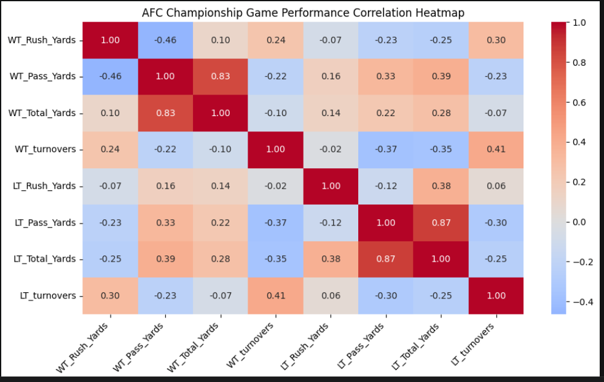
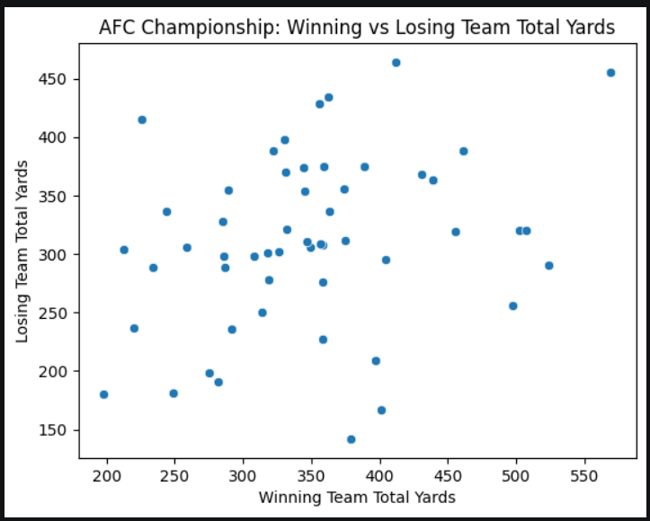
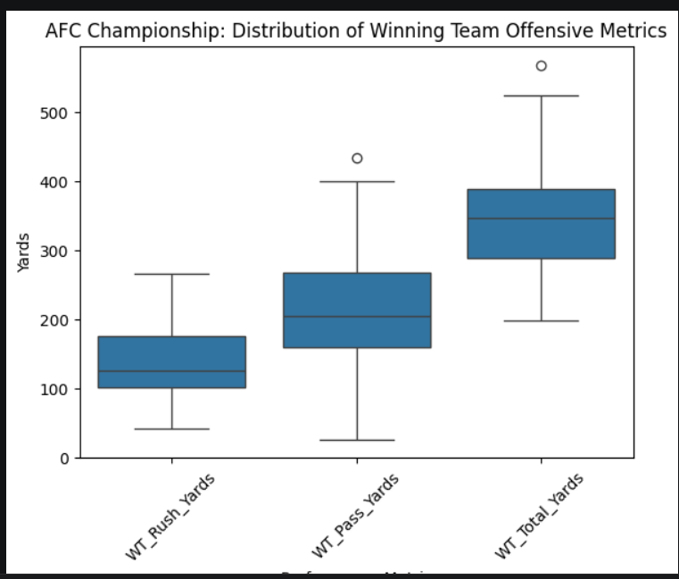
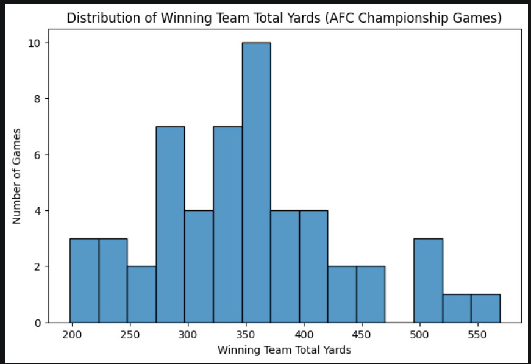

# AFC Championship Data Analysis (EDA Project)

## Project Overview
This project explores historical AFC Championship game data using Python and Jupyter Notebooks. The goal is to analyze game performance trends, including rushing yards, passing yards, total yards, and turnovers, to identify patterns that may influence winning outcomes.

---

## How to Run This Project
1. Clone the repository:
   git clone https://github.com/parkslarryjr/datafun-04-notebooks.git

2. Open the project in VS Code

3. Select the `.venv` Python environment as your Jupyter kernel

4. Open:
   notebooks/eda_afc.ipynb

5. Run cells individually or click "Run All"

---

## Key Visualizations

### Correlation Heatmap

### Scatter Plot (Flipper Length vs Body Mass)

### Box Plot (Flipper Length by Group)

### Histogram (Body Mass Distribution)

---

## Key Insights
- Teams with higher total yards generally had better outcomes
- Turnovers strongly influenced game results
- Passing yards showed more variability than rushing yards
- Certain teams consistently performed better in AFC Championship games

---

## Data Source
AFC Championship historical dataset used for exploratory data analysis practice.

---

## Tools Used
- Python
- Pandas
- Seaborn
- Matplotlib
- Jupyter Notebook
